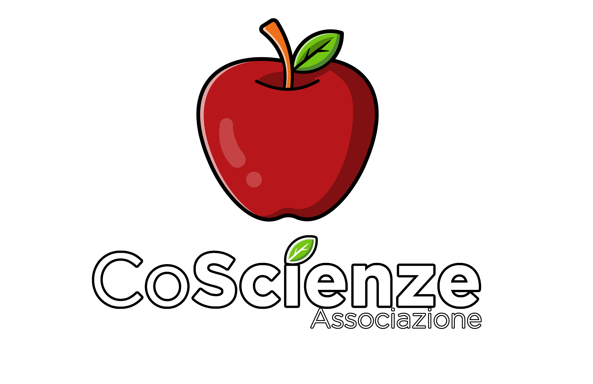

  
  <h1 align="center">Hello everyone!</h1>
    
It's CoScienze, UNISA's Computer Science students association!

## 🖥️ What is this for?
Our GitHub is used to share some of your best works here on GitHub, so that everyone can have a look at them!

 

## 🍎 About Us
CoScience is a students association that helps computer science students and it's located on the first floor of the F building at UNISA's campus.

 

## ⚠️ Disclaimer ⚠️
We fork repository under the consent of the owners and creators. We don't assume any responsability of the quality of the code you will find. Every project is from UNISA's students for their exams, shared with us for helping other students with their work too.

 

## 📫 How to reach us

  

